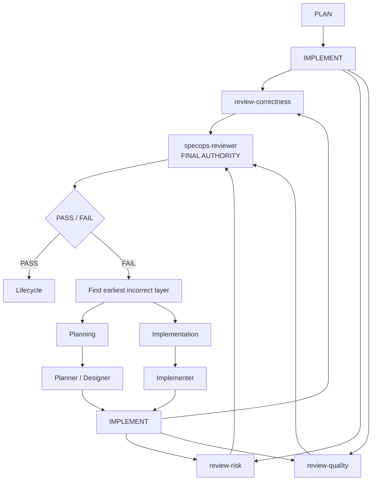

<div align="center">


**Spec-driven development for OpenCode, with the right model for each job.**

[](https://www.npmjs.com/package/@jrpbuilds/specops-opencode)
[](LICENSE)
[](https://github.com/jrpbuilds/specops-opencode/actions/workflows/ci.yml)
[](https://opencode.ai)
[](https://github.com/Fission-AI/OpenSpec)

</div>

SpecOps is a lightweight [OpenCode](https://opencode.ai) plugin that runs software changes through a structured [OpenSpec](https://github.com/Fission-AI/OpenSpec) workflow.

You give it a goal:

```text
/specops add a health endpoint with tests
```

Specialist agents then investigate the repository, work out the requirements, design the solution, plan the implementation, and write the code. Before anything gets archived, the finished work goes through three independent reviews. Each role can run on its own model, and OpenSpec keeps the whole change on disk as the source of truth.

## Documentation

|                                                        |                                                     |
| ------------------------------------------------------ | --------------------------------------------------- |
| [Getting started](docs/getting-started.md)             | Install, first run, and your first completed change |
| [How it works](docs/how-it-works.md)                   | The pipeline, the roles, Standard vs Auto           |
| [Configuration](docs/configuration.md)                 | The Configure screen and `specops.json` reference   |
| [Model recommendations](docs/model-recommendations.md) | Which model classes suit which roles                |
| [Commands](docs/commands.md)                           | Every command explained                             |
| [Troubleshooting](docs/troubleshooting.md)             | Doctor output, BLOCKED runs, common fixes           |

## Install

Install SpecOps through OpenCode:

```bash
opencode plugin @jrpbuilds/specops-opencode -g
```

Install the OpenSpec CLI:

```bash
npm install -g @fission-ai/openspec
```

Then restart OpenCode and check everything with:

```text
/specops-doctor
```

## Getting started

Open a project and give SpecOps a goal:

```text
/specops improve the API error responses and add coverage for the new behaviour
```

SpecOps initialises OpenSpec on first use, so there's nothing to set up by hand (or run `/specops-onboard` yourself if you prefer).

You approve the plan before implementation starts, and you decide what happens after review. If you want a run with no checkpoints at all, that's `/specops-auto`.

## How it works

The coordinator routes your change through specialist agents, then has the finished work reviewed from three independent perspectives before a final verdict. When implementation in one lane is staged across several assignments, SpecOps may reuse that lane's implementer session to preserve useful context while refreshing with fresh canonical state for every dispatch; a fresh implementer dispatch is always a valid fallback:



When the Reviewer fails the work, the coordinator finds the earliest incorrect layer (implementation, design, or requirements), gets it corrected there, and runs the whole review pipeline again. [How it works](docs/how-it-works.md) covers the details.

SpecOps keeps no persistent workflow state of its own: durable state lives in OpenSpec artifacts under `openspec/changes/<change>/`, while temporary session affinity ends with the coordinator run. That's why custom schemas work, and why an interrupted change picks up where it left off.

The specialist agents (`specops-explorer`, `specops-planner`, `specops-designer`, `specops-implementer`, `specops-reviewer`, the three review specialists, and optionally `specops-frontier`) are internal to SpecOps. Only its coordinators can dispatch them, they don't show up in OpenCode's `@` menu, and the coordinators themselves never edit files.

## Model configuration

Open the command palette (`Ctrl+P`), choose **SpecOps Configure**, and map any of the ten roles — coordinator, explorer, planner, designer, implementer, reviewer, three review specialists, and frontier — to their own model and reasoning variant.

Configuration lives at `~/.config/opencode/specops.json` and looks like this:

```json
{
    "frontierEscalation": false,
    "maxSubagentConcurrency": 1,
    "maxAutoReviewIterations": 3,
    "agents": {
        "specops-coordinator": { "model": "opencode-go/deepseek-v4-flash", "variant": "high" },
        "specops-planner": { "model": "openai/gpt-5.6-terra", "variant": "high" },
        "specops-reviewer": { "model": "openference/DeepSeek-V4-Pro", "variant": "high" }
    }
}
```

Any role you leave out inherits OpenCode's default model. Review specialists without their own entry inherit the Reviewer's. Specialists run one at a time by default; raise `maxSubagentConcurrency` (Configure offers 1–8) to parallelise planning routes and the review fan-out. Auto's correction budget defaults to 3 cycles, and both settings accept larger finite values if you set them directly in the file. For the best parallel experience, launch OpenCode with `OPENCODE_EXPERIMENTAL_BACKGROUND_SUBAGENTS=true` so a new specialist starts the moment one finishes.

For the full `specops.json` with all ten roles mapped, see [Configuration](docs/configuration.md#where-configuration-lives). For advice on which models go where, see [Model recommendations](docs/model-recommendations.md).

## Commands

| Command                      | Purpose                                                                |
| ---------------------------- | ---------------------------------------------------------------------- |
| `/specops <goal>`            | Start or resume a change in Standard mode                              |
| `/specops-auto <goal>`       | Fully autonomous run ending in `COMPLETED` or `BLOCKED`                |
| `/specops-update <feedback>` | Revise the active change in place                                      |
| `/specops-sync [<change>]`   | Merge an active change's delta specs into main specs without archiving |
| `/specops-onboard`           | Initialise OpenSpec in the current project                             |
| `/specops-doctor`            | Diagnose installation, OpenSpec, configuration, and models             |

Headless example: `opencode run --auto --command specops-auto "<goal>"`. Details in [Commands](docs/commands.md).

## Engram (optional)

SpecOps works fine without Engram. If you want agents to remember decisions and conventions across sessions, you can run the [Engram](https://github.com/Gentleman-Programming/engram) MCP server alongside it.

Engram is contextual memory only. What's in front of the agents always wins: your current instructions, the OpenSpec artifacts, the state of the repository, and evidence from commands that actually ran. See Engram's [installation guide](https://github.com/Gentleman-Programming/engram/blob/main/docs/INSTALLATION.md) and [OpenCode setup](https://github.com/Gentleman-Programming/engram/blob/main/docs/AGENT-SETUP.md).
When specialists resume the same active change, they can find prior breadcrumbs with gotchas, decisions, and conventions from earlier sessions. The coordinator may also pass concise, change-scoped breadcrumbs through the optional advisory `memoryContext` field. Memory is never used for workflow state, routing, or verdicts.

## Development

```bash
bun install
bun run check
```

`bun run build` builds the plugin. SpecOps uses Bun and TypeScript throughout.

## Status

SpecOps is actively developed, and I dogfood it on real software changes. Roadmap and open work live in the [issue tracker](https://github.com/jrpbuilds/specops-opencode/issues).

The idea behind the project: make structured multi-model software development useful without building another workflow engine.

## Community

- [Contributing](CONTRIBUTING.md)
- [Security](SECURITY.md)
- [Code of conduct](CODE_OF_CONDUCT.md)

## License

MIT — built by [@jrpbuilds](https://github.com/jrpbuilds).
