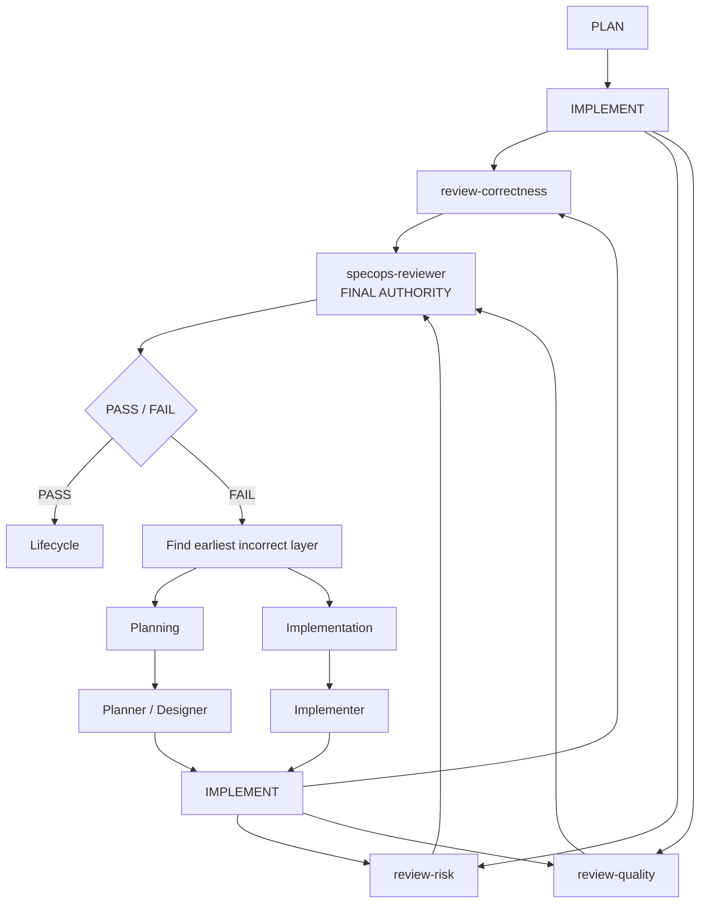

# How it works

SpecOps takes one goal and turns it into a fully reviewed software change by coordinating specialist agents around [OpenSpec](https://github.com/Fission-AI/OpenSpec) artifacts. Here's what happens, stage by stage.

## The pipeline

Every change flows through investigation, planning, implementation, and a multi-model review pipeline before it can be archived:



## The roles

| Role                                | What it does                                                                                |
| ----------------------------------- | ------------------------------------------------------------------------------------------- |
| Coordinator                         | Owns routing, checkpoints, and the OpenSpec lifecycle. Never writes code itself.            |
| Explorer                            | Investigates the repository and produces evidence-backed context for planning.              |
| Planner                             | Authors the proposal, specifications, and implementation tasks.                             |
| Designer                            | Authors the technical design artifact when the schema calls for one.                        |
| Implementer                         | Writes the source code and tests.                                                           |
| Review correctness / risk / quality | Three independent critics that review the finished work from different angles in parallel.  |
| Reviewer                            | The final authority. Combines the three critiques into one PASS/FAIL verdict.               |
| Frontier (optional)                 | A stronger escalation model consulted only for blockers that cheaper routes cannot resolve. |

The specialist agents are internal. Only SpecOps coordinators can dispatch them, they don't appear in OpenCode's `@` menu, and the coordinator itself can't edit files — it orchestrates.

## Planning comes from your schema, not a hardcoded list

SpecOps reads the active change's artifact graph from OpenSpec and routes whatever the schema declares. The default `spec-driven` schema typically produces:

```text
openspec/changes/<change>/
├── proposal.md
├── specs/
├── design.md
└── tasks.md
```

Custom schemas with different or fewer artifacts work the same way. The coordinator plans from the declared graph, sends each artifact to the role that owns it (design work to the Designer, everything else to the Planner), and skips nothing you didn't declare. And because all state is these files plus task checkboxes, an interrupted change just picks up where it left off: run `/specops` again and the coordinator re-reads the saved status instead of guessing.

Before any planning artifact is written, and again before review can pass, SpecOps validates the change with OpenSpec's own validator (`--strict`). A change that doesn't validate doesn't move forward.

## Review: three perspectives, one verdict

After implementation, the coordinator sends the work to three independent review specialists — **correctness**, **risk**, and **quality** — running in parallel up to your concurrency limit. Each returns a complete critique, and none of them sees the others' reports. Blocking findings are numbered (`F1`, `F2`, …) so they can be traced through remediation.

The same parallelism covers planning and implementation: independent planning artifacts author concurrently, and implementation parallelizes only when planned work is genuinely segregated so concurrent lanes actually finish sooner — otherwise one implementer builds the change serially. Launch OpenCode with `OPENCODE_EXPERIMENTAL_BACKGROUND_SUBAGENTS=true` for the best experience — parallel specialists then run as background tasks and each finished slot is refilled immediately, instead of waiting for every in-flight specialist to finish before the next batch starts.

The final `specops-reviewer` receives all three reports verbatim as evidence and owns the only PASS/FAIL decision. The critics don't vote and can't overrule it.

During the review window, review agents can't change tracked repository files or the `openspec/` tree. If protected state changes mid-review, the run stops rather than pass a review that no longer matches the work — so a PASS means the review looked at exactly what shipped.

## What happens on FAIL

A FAIL doesn't automatically go back to the Implementer. The coordinator classifies every finding by its correction target and fixes the **earliest incorrect layer** first:

- Findings about source or tests → straight back to the Implementer, findings verbatim.
- Findings about design → the Designer revises the design, downstream artifacts get reconciled, then implementation resumes.
- Findings about requirements or tasks → the Planner revises those artifacts first.
- Mixed findings → one coherent pass, earliest roots first, keeping completed work.

After correction, the full three-specialist fan-out runs again — never a partial subset — followed by a fresh Reviewer verdict.

## Standard vs Auto

Both modes use exactly the same pipeline. Only the lifecycle policy differs:

|                      | Standard (`/specops`)                                             | Auto (`/specops-auto`)                                                                   |
| -------------------- | ----------------------------------------------------------------- | ---------------------------------------------------------------------------------------- |
| Plan approval        | You approve before implementation starts                          | Auto-approves once planning completes                                                    |
| Specialist decisions | Surfaced to you as native questions                               | Chooses the most defensible option itself                                                |
| After PASS           | You choose: archive, leave open                                   | Archives automatically                                                                   |
| After FAIL           | You choose: address findings, archive despite them, or leave open | Automatically corrects and re-reviews within the configured iteration budget (default 3) |
| When stuck           | Waits for you                                                     | Returns a terminal `BLOCKED` report with exact findings and what is needed to continue   |

Auto ends every run with either `COMPLETED` (including verification and archive results) or `BLOCKED` (what stopped it, the evidence, and how to continue). It never loops forever: the correction budget is finite, and if the run is missing information it genuinely can't get, it stops and tells you rather than making something up.

## Memory across sessions (optional)

SpecOps works without any memory server. If you run the optional [Engram](https://github.com/Gentleman-Programming/engram) MCP server, agents can also look up decisions and conventions from earlier sessions. Engram is contextual memory only — current instructions, OpenSpec artifacts, repository state, and executed evidence always win. Install it via its [installation guide](https://github.com/Gentleman-Programming/engram/blob/main/docs/INSTALLATION.md) and [OpenCode setup](https://github.com/Gentleman-Programming/engram/blob/main/docs/AGENT-SETUP.md).
When specialists resume the same active change, change-scoped breadcrumbs can surface prior gotchas and decisions as leads to verify. The coordinator may optionally pass useful breadcrumbs to the next specialist as advisory memory context; it is never required.
