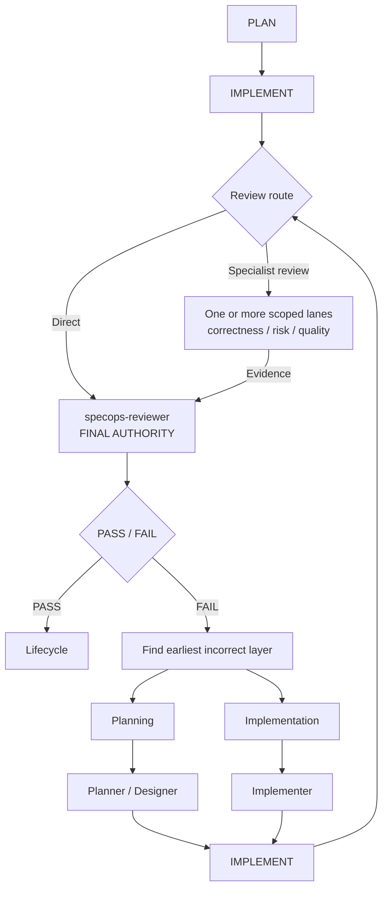

# How it works

SpecOps takes one goal and turns it into a fully reviewed software change by coordinating specialist agents around [OpenSpec](https://github.com/Fission-AI/OpenSpec) artifacts. Here's what happens, stage by stage.

## The pipeline

Every change flows through investigation, planning, implementation, and a multi-model review pipeline before it can be archived:



## The roles

| Role                                | What it does                                                                                             |
| ----------------------------------- | -------------------------------------------------------------------------------------------------------- |
| Orchestrator                        | Owns routing, checkpoints, and the OpenSpec lifecycle. Never writes code itself.                         |
| Explorer                            | Investigates the repository and produces evidence-backed context for planning.                           |
| Planner                             | Authors the proposal, specifications, and implementation tasks.                                          |
| Designer                            | Authors the technical design artifact when the schema calls for one.                                     |
| Implementer                         | Writes the source code and tests.                                                                        |
| Review correctness / risk / quality | Independent scoped lanes that review from three lenses; multiple lanes can share a lens when useful.     |
| Reviewer                            | The final authority. Combines the critiques into one PASS/FAIL verdict, or reviews a small change alone. |
| Frontier (optional)                 | A stronger escalation model consulted only for blockers that cheaper routes cannot resolve.              |

The specialist agents are internal. Only SpecOps orchestrators can dispatch them, they don't appear in OpenCode's `@` menu, and the orchestrator itself can't edit files — it orchestrates.

## Planning comes from your schema, not a hardcoded list

SpecOps reads the active change's artifact graph from OpenSpec and routes whatever the schema declares. The default `spec-driven` schema typically produces:

```text
openspec/changes/<change>/
├── proposal.md
├── specs/
├── design.md
└── tasks.md
```

Custom schemas with different or fewer artifacts work the same way. The orchestrator plans from the declared graph, sends each artifact to the role that owns it (design work to the Designer, everything else to the Planner), and skips nothing you didn't declare. And because all durable workflow state is these files plus task checkboxes, an interrupted change just picks up where it left off: run `/specops` again and the orchestrator re-reads the saved status instead of guessing; temporary lane/session affinity is discarded when the orchestrator run ends.

Before any planning artifact is written, and again before review can pass, SpecOps validates the change with OpenSpec's own validator (`--strict`). A change that doesn't validate doesn't move forward.

## Todo visibility

The native Todo sidebar is a runtime-owned projection of durable OpenSpec state, never workflow authority. Lifecycle results and every specialist dispatch return a compact refresh cue; the orchestrator performs one blind refresh per assistant turn when one or more cues arrive, and the runtime replaces the payload with a full projection. Refreshes are coalesced so batched status/validation calls do not produce duplicate updates, while the same cue path covers planning, implementation, parallel work, review, remediation, and archive. If a durable read briefly fails, SpecOps keeps the last successful projection visible rather than clearing the panel.

The list also follows review to the end. The runtime observes the reviewer's verdict from its result, so a pass checks off review and moves the list to the final archive step, while flagged findings route current work into the remediation and re-review stages as each round runs. A plan revision made after a passed review regresses the list back to the new implementation work. And when a change is archived, the whole list reads as completed — the run is over, so the panel finishes cleanly instead of leaving the last step dangling.

## Review: independent perspectives, one verdict

After implementation, the orchestrator chooses a proportionate review plan. Isolated low-risk work goes directly to `specops-reviewer`; a limited concern can get one or two focused specialist lanes first. Substantial or elevated-risk changes may receive the full **correctness**, **risk**, and **quality** gauntlet. When distinct surfaces warrant separate inspection, the orchestrator can expand beyond three scoped lanes, including multiple lanes with the same lens. It weighs subsystems, public contracts, browser behaviour, security, data changes, compatibility, failure paths, and implementation verification without using rigid file or task counts. Browser-visible work still needs appropriate runtime or browser verification. The configured concurrency limit controls simultaneous reviewers, not how many lanes are worth running.

The same parallelism covers planning and implementation: independent planning artifacts author concurrently, and implementation parallelizes only when the change is large enough and planned work is genuinely segregated so concurrent lanes actually finish sooner — small changes (roughly three or fewer files in one coherent area) and tightly related work always build on a single implementer. When one lane receives staged assignments, its implementer session may be reused to preserve useful context, but every dispatch receives fresh canonical state; a fresh implementer dispatch is always a valid fallback. Launch OpenCode with `OPENCODE_EXPERIMENTAL_BACKGROUND_SUBAGENTS=true` for the best experience — parallel specialists then run as background tasks and each finished slot is refilled immediately, instead of waiting for every in-flight specialist to finish before the next batch starts.

Specialists return independent critiques identified by review lane. The final `specops-reviewer` checks their evidence against the repository, explicitly disposes each blocking candidate, and owns the only PASS/FAIL decision. The critics don't vote and can't overrule it.

While lanes are running, the to-do list names each in-flight lane and its scope. `specops_progress` can show the active round's queued, running, completed, and failed lanes when diagnostics are needed. These views are temporary; after a restart, only durable change state remains until new work is observed.

During the review window, review agents can't change tracked repository files or the `openspec/` tree. If protected state changes mid-review, the run stops rather than pass a review that no longer matches the work — so a PASS means the review looked at exactly what shipped.

## What happens on FAIL

A FAIL doesn't automatically go back to the Implementer. The orchestrator classifies every finding by its correction target and fixes the **earliest incorrect layer** first:

- Findings about source or tests → straight back to the Implementer, findings verbatim.
- Findings about design → the Designer revises the design, downstream artifacts get reconciled, then implementation resumes.
- Findings about requirements or tasks → the Planner revises those artifacts first.
- Mixed findings → one coherent pass, earliest roots first, keeping completed work.

After correction, the orchestrator selects a fresh review plan for the current implementation, remaining findings, and regression risk. Specialist coverage can grow or narrow as relevant surfaces change; the final Reviewer still independently checks every prior finding and the complete approved change before a new verdict.

## Standard vs Auto

Both modes use exactly the same pipeline. Only the lifecycle policy differs:

|                      | Standard (`/specops`)                                             | Auto (`/specops-auto`)                                                                   |
| -------------------- | ----------------------------------------------------------------- | ---------------------------------------------------------------------------------------- |
| Plan approval        | You approve before implementation starts                          | Auto-approves once planning completes                                                    |
| Specialist decisions | Surfaced to you as native questions                               | Chooses the most defensible option itself                                                |
| After PASS           | You choose: archive, leave open                                   | Archives automatically                                                                   |
| After FAIL           | You choose: address findings, archive despite them, or leave open | Automatically corrects and re-reviews within the configured iteration budget (default 3) |
| When stuck           | Waits for you                                                     | Returns a terminal `BLOCKED` report with exact findings and what is needed to continue   |

Auto ends every run with either `COMPLETED` (including verification and archive results) or `BLOCKED` (what stopped it, the evidence, and how to continue). It never loops forever: the correction budget is finite, and if the run is missing information it genuinely can't get, it stops and tells you rather than making something up.

## Memory across sessions (optional)

SpecOps works without any memory server. If you run the optional [Engram](https://github.com/Gentleman-Programming/engram) MCP server, agents can also look up decisions and conventions from earlier sessions. Engram is contextual memory only — current instructions, OpenSpec artifacts, repository state, and executed evidence always win. Install it via its [installation guide](https://github.com/Gentleman-Programming/engram/blob/main/docs/INSTALLATION.md) and [OpenCode setup](https://github.com/Gentleman-Programming/engram/blob/main/docs/AGENT-SETUP.md).
When specialists resume the same active change, change-scoped breadcrumbs can surface prior gotchas and decisions as leads to verify. The orchestrator may optionally pass useful breadcrumbs to the next specialist as advisory memory context; it is never required.
