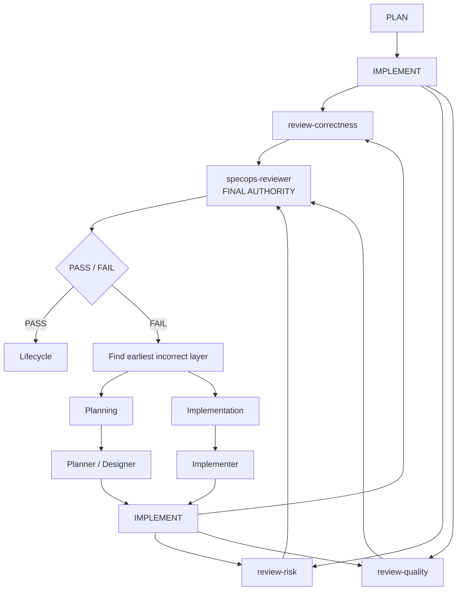

# How it works

SpecOps turns one goal into a fully reviewed software change by coordinating specialist agents around [OpenSpec](https://github.com/Fission-AI/OpenSpec) artifacts. This page explains what happens, stage by stage.

## The pipeline

Every change flows through investigation, planning, implementation, and a multi-model review pipeline before it can be archived:



## The roles

| Role                                | What it does                                                                                                          |
| ----------------------------------- | --------------------------------------------------------------------------------------------------------------------- |
| Coordinator                         | Owns routing, checkpoints, and the OpenSpec lifecycle. Never writes code itself.                                      |
| Explorer                            | Investigates the repository and produces evidence-backed context for planning.                                        |
| Planner                             | Authors the proposal, specifications, and implementation tasks.                                                       |
| Designer                            | Authors the technical design artifact when the schema calls for one.                                                  |
| Implementer                         | Writes the source code and tests.                                                                                     |
| Review correctness / risk / quality | Three independent critics that review the finished work from different angles in parallel.                            |
| Reviewer                            | The final authority. Combines the three critiques into one PASS/FAIL verdict — the critics never vote or overrule it. |
| Frontier (optional)                 | A stronger escalation model consulted only for blockers that cheaper routes cannot resolve.                           |

The specialist agents are internal: only SpecOps coordinators can dispatch them, they are hidden from OpenCode's `@` menu, and the coordinator itself cannot edit files — it orchestrates.

## Planning comes from your schema, not a hardcoded list

SpecOps reads the active change's artifact graph from OpenSpec and routes whatever the schema declares. The default `spec-driven` schema typically produces:

```text
openspec/changes/<change>/
├── proposal.md
├── specs/
├── design.md
└── tasks.md
```

Custom schemas with different or fewer artifacts work the same way — the coordinator plans from the declared graph, dispatches each artifact to its owning role (design work to the Designer, everything else to the Planner), and skips nothing you did not declare. Because all state lives in these files plus task checkboxes, an interrupted change resumes naturally: run `/specops` again and the coordinator re-reads durable status instead of guessing.

Before any planning artifact is authored, and again before review can pass, SpecOps validates the change with OpenSpec's own validator (`--strict`). A change that does not validate cannot move forward.

## Review: three perspectives, one verdict

After implementation, the coordinator fans the work out to three independent review specialists — **correctness**, **risk**, and **quality** — running in parallel up to your concurrency limit. Each returns a complete critique; they never see each other's reports. Every blocking finding is numbered (`F1`, `F2`, …) so it can be traced through remediation.

The final `specops-reviewer` receives all three reports verbatim as evidence and owns the only PASS/FAIL decision.

## What happens on FAIL

A FAIL is not automatically sent back to the Implementer. The coordinator classifies every finding by its correction target and fixes the **earliest incorrect layer** first:

- Findings about source or tests → straight back to the Implementer with the findings verbatim.
- Findings about design → the Designer revises the design, downstream artifacts are reconciled, then implementation resumes.
- Findings about requirements or tasks → the Planner revises those artifacts first.
- Mixed findings → one coherent pass, earliest roots first, preserving completed work.

After correction, the entire three-specialist fan-out runs again — never a partial subset — followed by a fresh Reviewer verdict.

## Standard vs Auto

Both modes use exactly the same pipeline. Only the lifecycle policy differs:

|                      | Standard (`/specops`)                                             | Auto (`/specops-auto`)                                                                   |
| -------------------- | ----------------------------------------------------------------- | ---------------------------------------------------------------------------------------- |
| Plan approval        | You approve before implementation starts                          | Auto-approves once planning completes                                                    |
| Specialist decisions | Surfaced to you as native questions                               | Chooses the most defensible option itself                                                |
| After PASS           | You choose: archive, leave open                                   | Archives automatically                                                                   |
| After FAIL           | You choose: address findings, archive despite them, or leave open | Automatically corrects and re-reviews within the configured iteration budget (default 3) |
| When stuck           | Waits for you                                                     | Returns a terminal `BLOCKED` report with exact findings and what is needed to continue   |

Auto ends every run with either `COMPLETED` (including verification and archive results) or `BLOCKED` (what stopped it, the evidence, and how to continue). It never loops forever: the correction budget is finite, and genuinely unknowable information stops the run rather than being fabricated.

## Memory across sessions (optional)

SpecOps works without any memory server. If you run the optional [Engram](https://github.com/Gentleman-Programming/engram) MCP server, agents may additionally consult historical decisions and conventions from earlier sessions. Engram is contextual memory only — current instructions, OpenSpec artifacts, repository state, and executed evidence always win. Install it via its [installation guide](https://github.com/Gentleman-Programming/engram/blob/main/docs/INSTALLATION.md) and [OpenCode setup](https://github.com/Gentleman-Programming/engram/blob/main/docs/AGENT-SETUP.md).
